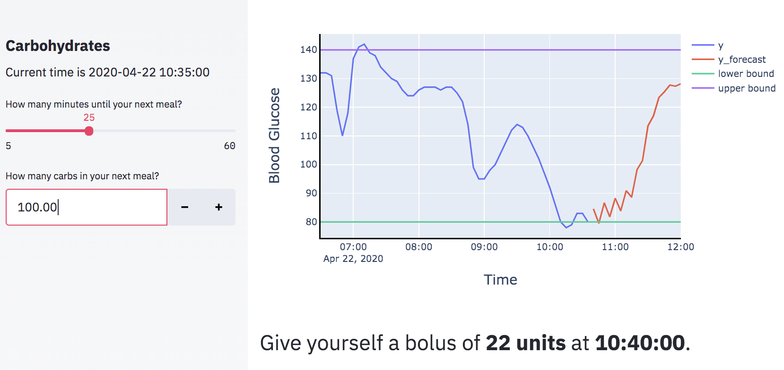
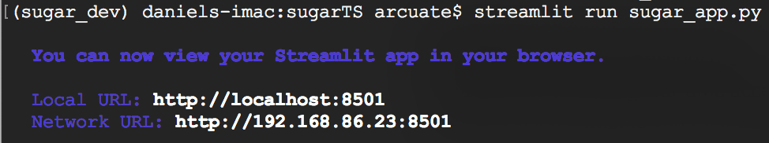

# SugarTime
### Time series forecasting and insulin optimization for Type 1 Diabetes

* [**Introduction**](https://github.com/danielkentwood/sugar#introduction)
* [**Installation**](https://github.com/danielkentwood/sugar#installation)
* [**Usage**](https://github.com/danielkentwood/sugar#usage)
* [**Web app**](https://github.com/danielkentwood/sugar#web-app)
* [**Limitations**](https://github.com/danielkentwood/sugar#limitations)

## Introduction

Most people never have to think about balancing glucose and insulin in their blood. Diabetes patients have to consciously assume this role because their pancreas isn't doing it for them. It can be exhausting. There is a lot of guesswork that goes into administering the correct amount of insulin at the correct time in order to counter the rise in glucose that will follow a meal.

The **SugarTime** package is a set of tools to model the effects of carbohydrates and insulin on blood glucose dynamics. The goal of these tools is to learn how a diabetic's blood glucose responds to food and to insulin. After it has learned this, the patient can provide the timing and amount of carbs they plan on eating, and the model will offer a best guess as to which insulin dosage will keep their blood glucose within an optimal range. 

The package uses a [NARX (Nonlinear AutoRegression with eXogenous)](https://en.wikipedia.org/wiki/Nonlinear_autoregressive_exogenous_model) time-series model. The NARX implementation relies on the fireTS package ([https://github.com/jxx123/fireTS](https://github.com/jxx123/fireTS)). The NARX model learns `y(t + k)` as a function of the history of `y` (e.g., `y(t), y(t-1), y(t-2),...`) and various transformations of any other exogenous timeseries variables, where `k` is the prediction step in a multioutput implementation of NARX. In essence, NARX is simply regression after transforming the data using three different types of lags. The _autoregression order_ specifies how many lagged copies of the target variable will be included in the design matrix. The _exogenous order_ specifies the same as _autoregression order_, but for the exogenous variables. The _exogenous delay_ specifies a constant lag applied to all columns corresponding to an exogenous variable.

## Installation
NOTE: This package requires python3.

To install, use pip. 

`pip install sugartime`

To get the latest development version:

```python
git clone https://github.com/danielkentwood/sugartime
cd sugartime
pip install -e .
```

## Usage

### Loading data

* Load your own data into a patient object:

```python
from sugartime.model import Patient
import numpy as np

# data
X = np.random.randn(100, 2)
y = np.random.randn(100, 1)

# create patient object and load data
patient = Patient()
patient.load_data(X, y)

```

* Load preprocessed example patient data and split into training and test sets:

```python
from sugartime.model import Patient

patient = Patient()
patient.load_example_data()
patient.split_data(
	target_name='estimated_glu',
	feature_names=['carb_grams', 'all_insulin'],
	split=[0.75])
```

### Fitting a multioutput NARX model

* Train a multioutput NARX model with a `RandomForestRegressor` base model:

```python
from sugartime.model import MultiOutModel
from sklearn.ensemble import RandomForestRegressor

# After loading patient data, create multioutput model object
mdl = MultiOutModel(patient, horizon=12)
estimator = {'RandomForest': RandomForestRegressor()}
mdl.fit(
	patient.Xtrain,
	patient.ytrain,
	estimator,
	auto_order=6,
	exog_order=[8, 8],
	exog_delay=[0, 0])
```

* Perform grid search on the design hyperparameters to find the optimal autoregression order, exogenous input order, and exogenous input delay for each output step:

```python
from sklearn.linear_model import LinearRegression
from itertools import product
	
# After loading patient data, create design hyperparameter grid
auto_order = range(1, 9)
exog_order = [[9, 9], [18, 18]]
exog_delay = [[0, 0], [5, 5]]
design_params = list(product(auto_order, exog_order, exog_delay))
   
# perform grid search to find best NARX models at each output step
mdl = MultiOutModel(patient, horizon=12)
estimators = {'linear': LinearRegression()}
mdl.grid_search(
    patient.Xtrain,
    patient.ytrain,
    patient.Xtest,
    patient.ytest,
    estimators,
    design_params)
```

### Forecasting
In the **SugarTime** package, forecasting comes in three flavors: (1) multioutput forecast, (2) dynamic forecast, and (3) hybrid forecast.  

* _Multioutput forecasting_ doesn't take into account any future information; based on information up to time `t`, it performs inference for `t+1, t+2,...t+n`, where `n` is the horizon of the model.

```python
# After fitting model, perform multioutput forecast
ypred = mdl.multioutput_forecast(
    patient.Xtest, patient.ytest
)
```

*  _Dynamic forecasting_ only uses the `t+1` model and iteratively updates the history of the endogenous variable with each consecutive inference. This can take into account future information (e.g., about timing and amount of carbohydrates and insulin).

```python
from datetime import timedelta

# After fitting model, define forecast start time 
start_time = mdl.patient.ytest.index[-1] + timedelta(minutes=5)

# define the future information
future = {
    "carb_grams": {start_time + timedelta(minutes=20): 15},
    "all_insulin": {start_time + timedelta(minutes=10): 3}}
    
# dynamic forecast
ypred = mdl.dynamic_forecast(
    mdl.patient.Xtest,
    mdl.patient.ytest,
    start_time,
    future)
```

* _Hybrid forecasting_ iteratively performs multioutput forecasting such that each output step of the model is a weighted average of all previous overlapping forecasts as well as the present forecast. For example, if the multioutput model has a horizon of 3, then the 3rd output step would be a weighted average of output step 1 from the multioutput forecast at `t+3`, output step 2 from the multioutput forecast at `t+2`, and output step 3 from the multioutput forecast at `t+1`. 


```python
# after defining the future information, perform hybrid forecast
ypred = mdl.hybrid_forecast(
    mdl.patient.Xtest,
    mdl.patient.ytest,
    start_time,
    future)
```


## Web app

The **SugarTime** web app provides a clean UI for the package. It uses the streamlit platform.

It is currently deployed at Heroku:

[sugar-ts.herokuapp.com/](sugar-ts.herokuapp.com/). 

I'm using the free tier so it might take a few seconds to load. :) 

UPDATE: I'm also trying out the beta version of Streamlit Sharing, so you can find the app here as well: [https://share.streamlit.io/danielkentwood/sugar/sugar_app.py](https://share.streamlit.io/danielkentwood/sugar/sugar_app.py) 

Here is an example of the app UI:



### Local testing of the web app

After installing the package and its dependencies on your computer, if you want to make changes to the web app, simply make the changes, open a terminal,  and run `streamlit run sugar_app.py` from within the main directory of the repo. You will see the following:



The app should pop up in your browser automatically.

## Limitations
I set out to build something useful for a family member who has diabetes. After lots of experiments, exploration, and tinkering, I've come to an understanding of why such an application doesn't exist yet. It is a really difficult problem. So this app is currently only a proof-of-concept. Here are its primary limitations:

 * The only time-series model available to use is a NARX (nonlinear autoregressive with exogenous regressors) design. Any regression model available within Scikit-Learn can act as the base algorithm. For the web app demo, I've currently got a vanilla support vector machine hardcoded as the base algorithm, but this can be changed. I plan on adding more model options in the future. For example, LSTM models are well suited for this flavor of time series forecasting. 
 * The data set is impoverished; it consists of blood glucose readings, carbohydrates consumed, and insulin injected. It's quite possible that my goal (accurate forecasting with a 60-90 minute horizon) isn't reachable without a dataset that is richer in features. Blood glucose is influenced by more than just carbs and insulin, and the effort to train a model without these other predictors may be doomed to hit a low ceiling in terms of model performance. There are richer datasets out there with predictors like sleep, heart rate, exercise, etc. 
 * This app is optimized for dealing with continuous blood glucose monitors (i.e., reading every 5 minutes). More specifically, the app currently only knows how to interpret raw historical data from the Clarity monitor and the Tandem glucose pump.  
 * There is no way to get real time forecasting since the app only takes historical data. Real time continuous forecasting would be awesome, but most device manufacturers make this difficult by adding a 3-hour lag to the data you can access from their APIs. The FDA recently relaxed the restrictions that were driving this lag, so hopefully manufacturers will soon make real-time access to data a reality.  
 * The bolus optimization approach is currently a brute force grid search that only allows for one bolus. It's a bit slow, and after adding the possibility for more than one bolus (e.g., staggered bolus for high protein/fat meals), brute force might become even more of a bottleneck; stochastic approaches will be more appropriate in that case. 
